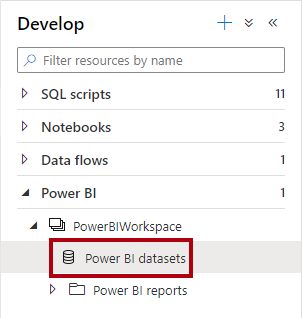
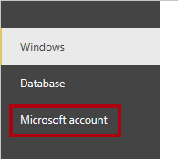
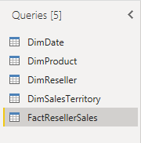
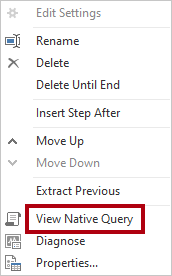
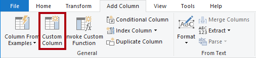
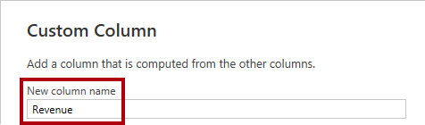
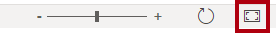

# Create a star schema model

## Overview

**The estimated time to complete the lab is 30 minutes**

In this lab, you will use Power BI Desktop to develop a data model over the Azure Synapse Adventure Works data warehouse. The data model will allow you to publish a semantic layer over the data warehouse.

In this lab, you learn how to:

- Create a Power BI connection to an Azure Synapse Analytics SQL pool.

- Develop model queries.

- Organize the model diagram.

## Get started

In this exercise, prepare your environment.

### Set up Power BI Desktop

In this task, you will set up Power BI Desktop.

1. To open Power BI Desktop, on the taskbar, select the **Power BI Desktop** shortcut.

	

2. Select **X** located at the top-right of the getting started window.

	

3. At the top-right corner of Power BI Desktop, if you're not already signed in, select **Sign In**. Use the lab credentials to complete the sign in process.

	

4. Close Power BI Desktop.

	*You will open Power BI Desktop again in the next exercise.*

### Start the SQL pool

In this task, you will start the SQL pool.

1. In a web browser, go to [https://portal.azure.com](https://portal.azure.com/).

2. Use the lab credentials to complete the sign in process.

3. Locate the SQL pool.

4. Resume the SQL pool.

	TODO: Provide an image

	*Important: The SQL pool is a costly resource. Please limit the use of this resource when working on this lab. The final task in this lab will instruct you to pause the resource.*

## Develop a data model

In this exercise, you will develop a DirectQuery model to support Power BI analysis and reporting of the data warehouse reseller sales subject.

### Download a dataset file

In this task, you will download a Power BI data source file from Synapse Studio.

1. In a web browser, navigate to **Synapse Studio**.

2. At the left, select the **Develop** hub.

	

3. In the **Develop** pane, expand **Power BI**, then expand the workspace, and then select **Power BI datasets**.

	

4. In the **Power BI Datasets** pane, select **New Power BI Dataset**.

	

5. In the left pane, at the bottom, select **Start**.

	

6. Select your SQL pool, possibly named **SQLPool01**, and then select **Continue**.

	

7. To download the .pbids file, select **Download**.

	

	*A .pbids file contains a connection to your SQL pool. It's a convenient way to start your project. When opened, it will create a new Power BI Desktop solution that already stores the connection details to your SQL pool.*

8. When the .pbids file has downloaded, open it.

	*When the file opens, it will prompt you to create queries using the connection. You will define those queries in the next task.*

### Create model queries

In this task, you will create five Power Query queries that will each load as a table to your model.

1. In Power BI Desktop, in the **SQL Server Database** window, at the left, select **Microsoft Account**.

	

2. Select **Sign In**.

3. Sign in using the lab Azure credentials.

4. Select **Connect**.

	

5. In the **Navigator** window, select (don't check) the **DimDate** table.

6. In the right pane, notice the preview result, which shows a subset of the table rows.

	

7. To create queries (which will become model tables), check the following five tables:

	- DimDate

	- DimProduct

	- DimReseller

	- DimSalesTerritory

	- FactResellerSales

8. To apply transformations to the queries, at the bottom-right, select **Transform Data**.

	

	*Transforming the data allows you to define what data will be available in your model.*


9. In the **Connection Settings** window, select the **DirectQuery** option.

	

	*This decision is important. DirectQuery is a storage mode. A model table that uses DirectQuery storage mode doesn't store data. So, when a Power BI report visual queries a DirectQuery table, Power BI sends a native query to the data source. This storage mode can be used for large data stores like Azure Synapse Analytics (because it could be impractical or uneconomic to import large data volumes) or when near real-time results are required.*

10. Select **OK**.

	


11. In the **Power Query Editor** window, in the **Queries** pane (located at the left), notice there is one query for each table you checked.

	

	*You will now revise the definition of each query. Each query will become a model table when it's applied to the model. You will now rename the queries, so they're described in more friendly and concise ways, and apply transformations to deliver the columns required by the known reporting requirements.*

12. Select the **DimDate** query.

	

13. In the **Query Settings** pane (located at the right), to rename the query, in the **Name** box, replace the text with **Date**, and then press **Enter**.

	


14. To remove unnecessary columns, on the **Home** ribbon tab, from inside the **Manage Columns** group, select the **Choose Columns** icon.

	

15. In the **Choose Columns** window, to uncheck all checkboxes, uncheck the first checkbox.

	


16. Check the following five columns.

	- DateKey

	- FullDateAlternateKey

	- EnglishMonthName

	- FiscalQuarter

	- FiscalYear

	

	*This selection of columns determine what will be available in your model.*

17. Select **OK**.

	

18. In the **Query Settings** pane, in the **Applied Steps** list, notice that a step was added to remove other columns.

	

	*Power Query defines steps to achieve the desired structure and data. Each transformation is a step in the query logic.*

19. To rename the **FullDateAlternateKey** column, double-click the **FullDateAlternateKey** column header.

20. Replace the text with **Date**, and then press **Enter**.

	

21. Notice that a new applied step is added to the query.

	

22. Rename the following columns:

	- **EnglishMonthName** as **Month**

	- **FiscalQuarter** as **Quarter**

	- **FiscalYear** as **Year**


23. To validate the query design, in the status bar (located along the bottom of the window), verify that the query has five columns.

	

	*Important: If the query design does not match, review the exercise steps to make any corrections.*

	*The design of the **Date** query is now complete.*

24. In the **Applied Steps** pane, right-click the last step, and then select **View Native Query**.

	

25. In the **Native Query** window, review the SELECT statement that reflects the query design.

	*This concept is important. A native query is what Power BI uses to query the data source. To ensure best performance, the database developer should ensure this query is optimized by creating appropriate indexes, etc.*

26. To close the **Native Query** window, select **OK**.

	


27. Select the **DimProduct** query.

	

28. Rename the query as **Product**.

	

29. To filter the query, in the **FinishedGoodsFlag** column header, open the dropdown menu, uncheck **FALSE**.

	

30. Select **OK**.


31. Remove all columns, except:

	- ProductKey

	- EnglishProductName

	- Color

	- DimProductSubcategory

32. To configure the query to join tables, in the **DimProductSubcategory** column header, select the **Expand** button, and then uncheck **(Select all columns)**.

	*This feature allows joining tables based on foreign key constraints in the source data. The design approach taken by this lab is to join snowflake dimension tables together to produce a denormalized representation of the data.*

33. Uncheck the **Use original column name as prefix**.

	

34. Check the following two columns:

	- EnglishProductSubcategoryName

	- DimProductCategory

35. Select **OK**.

36. Repeat the previous steps to expand the **DimProductCategory** and introduce the **EnglishProductCategoryName** column.


37. Rename the following columns:

	- **EnglishProductName** as **Product**

	- **EnglishProductSubcategoryName** as **Subcategory**

	- **EnglishProductCategoryName** as **Category**

38. In the **Applied Steps** pane, right-click the last step, and then select **View Native Query**.

	

39. In the **Native Query** window, review the SELECT statement that reflects the query design.

	*The statement includes nested subqueries to produce the denormalized query result.*

40. To close the **Native Query** window, select **OK**.

41. Verify that the query has five columns.

	*The design of the **Product** query is now complete.*

42. Select the **DimReseller** query.

	

43. Rename the query as **Reseller**.

44. Remove all columns, except:

	- ResellerKey

	- BusinessType

	- ResellerName

45. Rename the following columns:

	- **BusinessType** as **Business Type** (separate with a space)

	- **ResellerName** as **Reseller**

46. Verify that the query has three columns.

	*The design of the **Reseller** query is now complete.*

47. Select the **DimSalesTerritory** query.

	

48. Rename the query as **Territory**.

49. Remove all columns, except:

	- SalesTerritoryKey

	- SalesTerritoryRegion

	- SalesTerritoryCountry

	- SalesTerritoryGroup

50. Rename the following columns:

	- **SalesTerritoryRegion** as **Region**

	- **SalesTerritoryCountry** as **Country**

	- **SalesTerritoryGroup** as **Group**

51. Verify that the query has four columns.

	*The design of the **Territory** query is now complete.*

52. Select the **FactResellerSales** query.

	

53. Rename the query as **Sales**.

54. Remove all columns, except:

	- ResellerKey

	- ProductKey

	- OrderDateKey

	- SalesTerritoryKey

	- OrderQuantity

	- UnitPrice

	

55. Rename the following columns:

	- **OrderQuantity** as **Quantity**

	- **UnitPrice** as **Price**

56. To add a calculated column, on the **Add Column** ribbon tab, from inside the **General** group, select **Custom Column**.

	


57. In the **Custom Column** window, in the **New Column Name** box, replace the text with **Revenue**.

	

58. In the **Custom Column Formula** box, enter the following formula:

	```
	[Quantity] * [Price]
	```


59. Select **OK**.

60. To modify the column data type, in the **Revenue** column header, select **ABC123**, and then select **Decimal Number**.

	

61. Review the native query, noticing the **Revenue** column calculation logic.

62. Verify that the query has seven columns.

	*The design of the **Sales** query is now complete.*


63. To apply the queries, on the **Home** ribbon tab, from inside the **Close** group, select the **Close &amp; Apply** icon.

	

	*Each query is applied to create a model table. Because the data connection is using DirectQuery storage mode, only the model structure is created. No data is imported. The model now consists of one table for each query.*

64. In Power BI Desktop, when the queries have been applied, at the bottom-left corner in the status bar, notice that the model storage mode is DirectQuery.

	

### Organize the model diagram

In this task, you will organize the model diagram to easily understand the star schema design.

1. In Power BI Desktop, at the left, select **Model** view.

	

2. To resize the model diagram to fit to screen, at the bottom-left, select the **Fit to screen** icon.

	

3. Drag the tables into position so that the **Sales** fact table is located at the middle of the diagram, and the remain tables, which are dimension tables, are located around the fact table.

4. If any of the dimension tables aren't related to the fact table, use the following instructions to create a relationship:

	- Drag the dimension key column (for example, **ProductKey**) and drop it on the corresponding column of the **Sales** table.

	- In the **Create Relationship** window, select **OK**.


5. Review the final layout of the model diagram.

	

	*The creation of the star schema model is now complete. There are many modeling configurations that could now be applied, like adding hierarchies, calculations, and setting properties like column visibility.*

6. Optionally, to save the solution, at the top-left, select the disk icon.

7. In the **Save As** window, go to the **D:\DP500\Create a star schema model\Solution** folder.

8. In the **File name** box, enter **Sales Analysis**.

	

9. Select **Save**.

10. Close Power BI Desktop.

### Stop the SQL pool

In this task, you will stop the SQL pool.

1. In a web browser, go to [https://portal.azure.com](https://portal.azure.com/).

2. Locate the SQL pool.

3. Stop the SQL pool.

	TODO: Provide an image
