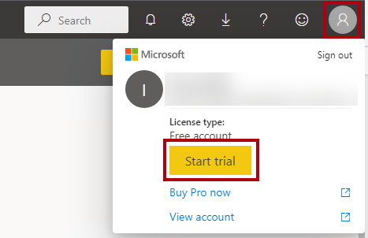
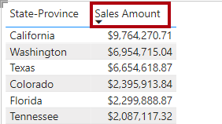
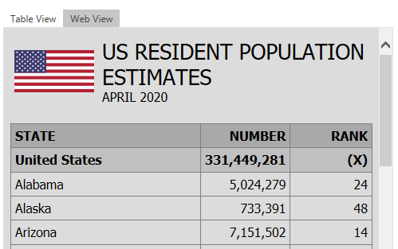

# DP500: Create reusable Power BI artifacts

## Overview

**The estimated time to complete the lab is 45 minutes**

In this lab, you will create a specialized Power BI dataset that extends a core datasets. The specialized dataset will enable the analysis of US sales per capita.

In this lab, you learn how to:

- Create a live connection.

- Create a local DirectQuery model.

- Use lineage view to discover dependent Power BI artifacts.

## Get started

In this exercise, you will prepare your environment.

### Sign in to the Power BI service

In this task, you will sign in to the Power BI service, start a trial license, and create a workspace.

*Important: If you have already setup Power BI in your VM environment, continue to the next task.*

1. In a web browser, go to [https://powerbi.com](https://powerbi.com/).

2. Use the lab credentials to complete the sign in process.

	*Important: You must use the same credentials used to sign in from Power BI Desktop.*

3. At the top-right, select the profile icon, and then select **Start trial**.

	

4. When prompted, select **Start trial**.

	

5. Do any remaining tasks to complete the trial setup.

	*Tip: The Power BI web browser experience is known as the **Power BI service**.*

### Create a workspace

In this task, you will create a workspace.

1. In the Power BI service, to create a workspace, in the **Navigation** pane (located at the left), select **Workspaces**, and then select **Create workspace**.

	


2. In the **Create a workspace** pane (located at the right), in the **Workspace name** box, enter a name for the workspace.

	*The workspace name must be unique within the tenant.*

	

3. Select **Save**.

	

	*Once created, the workspace opens. In the next task, you will publish a dataset to this workspace.*

### Set up Power BI Desktop

In this task, you will set up Power BI Desktop.

1. To open File Explorer, on the taskbar, select the **File Explorer** shortcut.

	

2. Go to the **D:\DP500\Create reusable Power BI artifacts\Starter** folder.

3. To open a pre-developed Power BI Desktop file, double-click the **Sales Analysis - Create reusable Power BI artifacts.pbix** file.

4. If you're not already signed in, at the top-right corner of Power BI Desktop, select **Sign In**. Use the lab credentials to complete the sign in process.

	

### Review the data model

In this task, you will review the data model.

1. In Power BI Desktop, at the left, switch to **Model** view.

	

2. Use the model diagram to review the model design.

	

	*The model comprises six dimension tables and one fact table. The **Sales** fact table stores sales order details. It's a classic star schema design.*

### Publish the data model

In this task, you will publish the data model.

1. To publish the report, on the **Home** ribbon tab, select **Publish**.

	

2. In the **Publish to Power BI** window, select your workspace (not the personal workspace), and then select **Select**.

	

3. When the publishing succeeds, select **Got it**.

	

	*Once published, the model becomes a Power BI dataset. In this lab, this dataset is a core dataset that a business analyst can extend to create a specialized dataset. In the next exercise, you will create a specialized dataset to solve a specific business requirement.*

4. Close Power BI Desktop.

5. If prompted to save changes, select **Don't save**.

	

## Create a specialized dataset

In this exercise, you will create a specialized dataset to allow the analysis of US sales per capita. Because the core datasets doesn't contain population values, you will add a new table to extend the model.

### Create a live connection

In this task, you will create a new report that uses a live connection to the **Sales Analysis - Create reusable Power BI artifacts** dataset, which you published in the previous exercise.

1. To open Power BI Desktop, on the taskbar, select the **Power BI Desktop** shortcut.

	

2. Select **X** located at the top-right of the getting started window.

	

3. To save the file, on the **File** ribbon, select **Save as**.

4. In the **Save As** window, go to the **D:\DP500\Create reusable Power BI artifacts\MySolution** folder.

5. In the **File name** box, enter **US Sales Analysis**.

	

6. Select **Save**.

7. To create a live connection, on the **Home** ribbon tab, from inside the **Data** group, select **Power BI datasets**.

	

8. In the **Select a dataset to create a report** window, select the **Sales Analysis - Create reusable Power BI artifacts** dataset.

	

9. Select **Create**.

	

10. At the bottom left, in the status bar, notice that the report connects live to the dataset.

	

11. Switch to **Model** view.

	

12. If necessary, to fit the model diagram to your screen, at the bottom right, select **Fit to screen**.

	

13. Hover the cursor over any table header to reveal a tooltip, and notice that the data source type is SQL Server Analysis Services, the server refers to your workspace, and the database is the dataset.

	

	*These properties indicate that a remote model hosts the table. In the next task, you will make changes to the model to extend it. That process will create a local DirectQuery model that you can modify in many different ways.*

14. Save the Power BI Desktop file.

	

### Create a local DirectQuery model

In this task, you will create a local DirectQuery model.

1. On the **Home** ribbon tab, from inside the **Modeling** group, select **Make changes to this model**.

	

2. When prompted, read the dialog window message, and then select **Add a local model**.

	

	*The model is now a DirectQuery model. It's now possible to enhance the model by modifying certain table or column properties, or adding calculated columns. It's even possible to extend the model with new tables of data that are sourced from other data sources. You will add a table to add US population data to the model.*

3. Hover the cursor over any table header to reveal a tooltip, and notice that the table storage mode is set to **DirectQuery**.

	

### Design the report layout

In this task, you will design the report layout to analyze US state sales.

1. Switch to **Report** view.

	

2. In the **Fields** pane (located at the right), expand open the **Reseller** table.

3. Right-click the **Country-Region** field, and then select **Add to filters** > **Report-level filters**.

	

4. Expand open the **Filters** pane (located at the left of the **Visualizations** pane).

5. In the **Filters** pane, in the **Filters on all pages** section, in the **Country-Region** card, select **United States**.

	

6. To add a table visual, in the **Visualizations** pane, select the table visual icon.

	

7. Reposition and resize the table so that it fills the entire page.

8. In the **Fields** pane, from inside the **Reseller** table, drag the **State-Province** field and drop it into the table visual.

	

9. In the **Fields** pane, expand the **Sales** table, and then add the **Sales Amount** field to the table visual.

	

10. To sort the states by descending order of sales amount, select the **Sales Amount** header.

	

	*This report layout now provides basic detail about US state sales. However, an additional requirement is to show sales per capita and sort states by descending order of that measure.*

### Add a table

In this task, you will add a table of US population data sourced from a web page.

1. Switch to **Model** view.

	

2. On the **Home** ribbon tab, from inside the **Data** group, select **Get data**, and then select **Web**.

	

3. In the **URL** box, enter the following file path: **D:\DP500\Create reusable Power BI artifacts\Assets\us-resident-population-estimates-2020.html**

	*For the purposes of this lab, Power BI Desktop will access the web page from the file system.*

	*Tip: The file path is available to copy and paste from the **D:\DP500\Create reusable Power BI artifacts\Assets\Snippets.txt** file.*

4. Select **OK**.

	

5. In the **Navigator** window, at the right, switch to **Web View**.

	

	*The web page presents US resident population estimates sourced from the April 2020 census.*

6. Switch back to Table view.

	

7. At the left, select **Table 2**.

	

8. Notice the table view preview.

	*This table of data contains the data that's required by your model to calculate sales per capita. You will need to prepare the data by applying transformations: Specifically, you will remove the row for **United States**, remove the **RANK** column, and rename the **STATE** and **NUMBER** columns.*

9. To prepare the data, select **Transform Data**.

	

10. In the Power Query Editor window, in the **Query Settings** pane (located at the right), in the **Name** box, replace the text with **US Population**, and then press **Enter**.

	

11. To remove the **United States** row, in the **STATE** column header, select the down-arrow, and then unselect the **United States** item (scroll to the bottom of the list).

	

12. Select **OK**.

	

13. To remove the **RANK** column, right-click the column header, and then select **Remove**.

	

14. To rename the **STATE** column, double-click the column header, replace the text with **State**, and then press **Enter**.

15. Rename the **NUMBER** column as **Population**.

	

16. To apply the query, on the **Home** ribbon tab, from inside the **Close** group, select the **Close &amp; App**ly icon.

	

17. When prompted about a potential security risk, read the notification, and then select **OK**.

	

	*Power B Desktop applies the query to create a model table. It adds a new table that imports population data to the model.*

18. Reposition the **US Population** table near the **Reseller** table.

19. To create a model relationship, from the **US Population** table, drag the **State** column and drop it on the **State-Province** column of the **Reseller** table.

	

20. In the **Create Relationship** window, in the **Cross Filter Direction** dropdown list, select **Both**.

	

	*Each row of the **Reseller** table stores a reseller, so the values found in the **State-Province** column will contain duplicate values (for example, there are many resellers in the state of California). When you create the relationship, Power BI Desktop automatically determines column cardinalities and discovered that it's a many-to-one relationship. To ensure filters propagate from the **Reseller** table to the **US Population** table, the relationship must cross filter in both directions.*

21. Select **OK**.

	

22. To hide the new table, in the header of the **US Population** table, select the visibility icon.

	

	*The table doesn't need to be visible to report authors.*

### Add a measure

In this task, you will add a measure to calculate sales per capita.

1. Switch to **Report** view.

	

2. In the **Fields** pane, right-click the **Sales** table, and then select **New measure**.

	

3. In the formula bar, enter the following measure definition.

	*Tip: The measure definition is available to copy and paste from the **D:\DP500\Create reusable Power BI artifacts\Assets\Snippets.txt** file.*

	```
	Sales per Capita =
	DIVIDE(
	SUM(Sales[Sales Amount]),
	SUM('US Population'[Population])
	)
	```

	*The measure named **Sales per Capita** uses the DAX [DIVIDE](https://docs.microsoft.com/dax/divide-function-dax) function to divide the sum of the **Sales Amount** column by the sum of the **Population** column.*

4. On the **Measure Tools** contextual ribbon tab, from inside the **Formatting** group, in the decimal places box, enter **4**.

	

5. To add the measure to the matrix visual, in the **Fields** pane, from inside the **Sales** table, drag the **Sales per Capita** field into the table visual.

	*The measure evaluates the result by combining data sourced from a remote model in the Power BI service with data from the imported table that is local to your new model.*

6. To sort the states by descending sales per capita value, select the **Sales per Capita** column header.

	

### Publish the solution

In this task, you will publish the solution, which comprises a specialized data model and a report.

1. Save the Power BI Desktop file.

	

2. To publish the solution, on the **Home** ribbon tab, select **Publish**.

	

3. In the **Publish to Power BI** window, select your workspace, and then select **Select**.

	

4. When the publishing succeeds, select **Got it**.

	

5. Close Power BI Desktop.

6. If prompted to save changes, select **Don't save**.

	

### Review the specialized dataset

In this task, you will review the specialized dataset in the Power BI service.

1. Switch to the Power BI service (web browser).

2. In the workspace landing page, notice the **US Sales Analysis** report and **US Sales Analysis** dataset.

	


3. Hover the cursor over the **US Sales Analysis** dataset, and when the ellipsis appears, select the ellipsis, and then select **View lineage**.

	

	*The **View lineage** option supports finding out dependencies between Power BI artifacts. That's important, for example, if you are going to publish changes to a core dataset. Lineage view will tell you the dependent datasets that might require testing.*

4. In lineage view, notice the connection between the report, the **US Sales Analysis** dataset, and the **Sales Analysis - Create reusable Power BI artifacts** dataset.

	

	*When Power BI datasets relate to other datasets, it's known as chaining. In this lab, the **US Sales Analysis** dataset is chained to the **Sales Analysis - Create reusable Power BI artifacts** dataset, enabling its reuse for a specialized purpose.*
