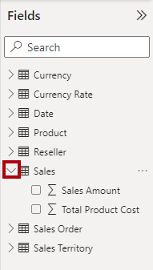
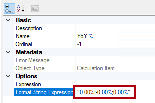
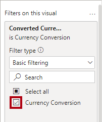

# DP500: Improve performance with hybrid tables

## Overview

The estimated time to complete the lab is 45 minutes

In this lab, you will set up incremental refresh and enable a DirectQuery
partition to deliver real time updates and improve refresh and query
performance.

In this lab, you learn how to:

-   Set up incremental refresh.

-   Review table partitions.

## Get started

In this exercise, you will prepare your environment.

### Set up the Power BI service

In this task, you will sign in to the Power BI service and start a trial
license.

Important: If you have already setup Power BI in your VM environment, continue
to the next task.

1.  In a web browser, go to <https://powerbi.com>.

2.  Use the lab credentials to complete the sign in process.

3.  At the top-right, select the profile icon, and then select **Start trial**.

    

4.  When prompted, select **Start trial**.

    

    You require a Power BI Premium per User (PPU) license to complete this lab.
    A trial license is sufficient.

5.  Do any remaining tasks to complete the trial setup.

    Tip: The Power BI web browser experience is known as the **Power BI
    service**.

### Create a workspace

In this task, you will create a workspace.

1.  In the Power BI service, to create a workspace, in the **Navigation** pane
    (located at the left), select **Workspaces**, and then select **Create
    workspace**.

    

2.  In the **Create a workspace** pane (located at the right), in the
    **Workspace name** box, enter a name for the workspace.

    The workspace name must be unique within the tenant.

    

3.  Beneath the **Description** box, expand open the **Advanced** section.

    

4.  Set the **License mode** option to **Premium per user**.

    

    Power BI only supports incremental refresh and hybrid tables in Premium
    workspaces.

5.  Select **Save**.

    

    Once created, the Power BI service opens the workspace. You will return to
    this workspace later in this lab.

### Set up the Azure SQL Database

In this task, you will set up the Azure SQL Database to allow connections from
your virtual machine’s (VM’s) IP address.

1.  In a web browser, go to <https://portal.azure.com>.

2.  If prompted to take a tour, select **Maybe later**.

    

3.  Select the **SQL databases** tile.

    

4.  In the list of SQL databases, select the **AdventureWorksDW2022-DP500**
    database.

5.  In the action bar, select **Set server firewall**.

    

6.  In the firewall settings, select **Add client IP**.

    

7.  Select **Save**.

    

8.  Close the Azure portal web browser session.

### Set up Power BI Desktop

In this task, you will open a pre-developed Power BI Desktop solution, set the
data source settings and permissions, and then refresh the data model.

1.  To open File Explorer, on the taskbar, select the **File Explorer**
    shortcut.

    

2.  Go to the **D:\\DP500\\Improve performance with hybrid tables\\Starter**
    folder.

3.  To open a pre-developed Power BI Desktop file, double-click the **Sales
    Analysis – Improve performance with hybrid tables.pbix** file.

4.  To edit the database data source, on the **Home** ribbon tab, from inside
    the **Queries** group, select the **Transform data** dropdown, and then
    select **Data source settings**.

    

5.  In the **Data source settings** window, select **Change Source**.

    

6.  In the **SQL Server database** window, in the **Server** box, replace the
    text with the lab Azure SQL Database server.

7.  Select **OK**.

    

8.  Select **Edit Permissions**.

    

9.  In the **Edit Permissions** window, to edit the database credentials, select
    **Edit**.

    

10. In the **SQL Server database** window, TBC

    TODO: Screenshot

11. Select **OK**.

    

12. In the **Data source settings** window, select **Close**.

    

13. On the **Home** ribbon tab, from inside the **Queries** group, select the
    **Transform data** dropdown, and then select **Refresh**.

    

14. Wait until the data refresh completes.

15. To save the file, on the **File** ribbon tab, select **Save as**.

16. In the **Save As** window, go to the **D:\\DP500\\Improve performance with
    hybrid tables\\MySolution** folder.

17. Select **Save**.

18. If you’re not already signed in, at the top-right corner of Power BI
    Desktop, select **Sign In**. Use the lab credentials to complete the sign in
    process.

    Important: You must use the same credentials used to sign in to the Power BI
    service.

    

### Review the report

In this task, you will review the pre-developed report.

1.  In Power BI Desktop, review the report design.

    

    The report page has a title and two visuals. The slicer visual allows
    filtering by a single fiscal year, while the bar chart visual displays
    monthly sales amounts. In this lab, you will improve the performance of the
    report by setting up incremental refresh and a hybrid table.

### Review the data model

In this task, you will review the pre-developed data model.

1.  Switch to **Model** view.

    

2.  Use the model diagram to review the model design.

    

    The model comprises five dimension tables and one fact table. Each table
    uses import storage mode. The **Sales** fact table represents sales order
    details. It’s a classic star schema design.

    In this lab, you will set up the **Sales** table to use incremental refresh
    and become a hybrid table. A hybrid table includes a DirectQuery partition
    that represents the latest time period. That partition ensures current data
    from the data source is available in Power BI reports.

## Set up incremental refresh

In this exercise, you will set up incremental refresh.

Incremental refresh extends scheduled refresh operations by providing automated
partition creation and management for dataset tables that frequently load new
and updated data. It helps to reduce refresh time, placing lower burdens on
source data and Power BI. It can also help surface current data to Power BI
report more quickly.

### Add parameters

In this task, you will add two parameters.

1.  To open the Power Query Editor window, on the **Home** ribbon tab, from
    inside the **Queries** group, click the **Transform data** icon.

    

2.  In the Power Query Editor window, from inside the **Queries** pane, select
    the **Sales** query.

    

3.  In the preview pane, notice the **OrderDate** column, which is a date/time
    column.

    Incremental refresh requires that the table contain a date column of
    date/time or integer data type with the value formatted as yyyymmdd.

    To setup incremental refresh, you must create parameters that Power BI will
    use to filter this column to create table partitions.

4.  To create a parameter, on the **Home** ribbon tab, select the **Manager
    Parameters** icon.

    

5.  In the **Manage Parameters** window, select **New**.

    

6.  In the **Name** box, replace the text with **RangeStart**.

7.  In the **Type** dropdown list, select **Date/Time**.

8.  In the **Current Value** box, enter **6/1/2022** (June 1, 2022 - the VM uses
    US date formats).

    While setting up the parameters, you can use an arbitrary values. Power BI
    will update parameter values when it creates and manages the partitions. In
    this lab, you’ll set a range for the month of June 2022.

    

9.  To create a second parameter, select **New**.

10. Set the following parameter properties:

-   Name: **RangeEnd**

-   Type: **Date/Time**

-   Current Value: **7/1/2022** (July 1, 2022)

    

1.  Select **OK**.

    

### Filter the query

In this task, you will add filters to the **Sales** query.

1.  In the **Queries** pane, select the **Sales** query.

2.  In the header of the **OrderDate** column, select the down arrow, and then
    select **Date/Time Filters** \> **Between**.

    

3.  In the **Filter Rows** window, select the first calendar icon dropdown list,
    and then select **Parameter**.

    

4.  In the adjacent dropdown list, notice that the **RangeStart** parameter is
    set.

    The default parameter selection is the correct one.

5.  In the second “range” dropdown list, select **is before**.

    

6.  In the corresponding dropdown lists, select the **RangeEnd** parameter.

    

7.  Select **OK**.

    

8.  On the **Home** ribbon tab, from inside the **Close** group, click the
    **Close & Apply** icon.

    

9.  Notice that Power BI Desktop loaded 5,134 rows into the **Sales** table.

    

    These are the filtered rows for the June 2022.

10. Save the Power BI Desktop file.

    

### Set up incremental refresh

In this task, you will set up the incremental refresh policy for the **Sales**
table.

1.  In the model diagram, right-click the **Sales** table header, and then
    select **Incremental refresh**.

    

2.  In the **Incremental refresh and real-time data** window, at step 2, turn on
    incremental refresh.

    

3.  Set the following: Archive data starting **2 Years** before refresh date.

    

    This setting determines the historical period. In this instance, Power BI
    will create two whole-year partitions for historic data.

4.  Set the following: Incrementally refresh data starting **7 Days** before
    refresh date.

    

    This setting determines the incremental refresh period in which all rows
    with a date/time in that period are included in the refresh partition(s) and
    refreshed with each refresh operation.

5.  At step 3, check the **Get the latest data in real time with DirectQuery**
    option.

    

    This setting enables fetching the latest changes from the selected table at
    the data source beyond the incremental refresh period by using DirectQuery.
    All rows with a date/time later than the incremental refresh period are
    included in a DirectQuery partition and fetched from the data source with
    every dataset query. This setting makes the table a hybrid table because it
    will contain import partitions and one DirectQuery partition.

6.  Select **Apply**.

    

7.  Save the Power BI Desktop file.

    

### Publish the dataset

In this task, you will publish the dataset.

1.  To publish the report, on the **Home** ribbon tab, select **Publish**.

    

2.  In the **Publish to Power BI** window, select the workspace created in this
    lab, and then select.

    

3.  When the publishing succeeds, select **Got it**.

    

4.  Close Power BI Desktop.

5.  If prompted to save changes, select **Save**.

    

### Set up the dataset

In this task, you will set up the data source credentials and refresh the
dataset.

1.  Switch to the Power BI service web browser session.

2.  In the workspace landing page, locate the report and dataset.

    

3.  Hover the cursor over the dataset, and when the ellipsis appears, select the
    ellipsis, and then select **Settings**.

    

4.  In the **Data source credentials** section, select the **Edit credentials**
    link.

    

5.  In the window, TBC

6.  TODO: Screenshot

7.  Select **Sign In**.

    

8.  Expand open the **Scheduled refresh and performance optimization** section.

    

9.  Notice, but do not change, any of the settings.

    In a real world set up, you schedule data refresh to allow Power BI to
    refresh and manage the partitions on a recurring basis.

    In this lab, you will do an on-demand refresh.

10. In the **Navigation** pane (located at the left), select your workspace.

11. In the workspace landing page, hover the cursor over the dataset, and then
    select the **Refresh** icon.

    

12. In the **Refreshed** column, notice the spinning icon, and wait until it
    stops (indicating that the refresh has completed).

    

13. To open the workspace settings, at the top right, select **Settings**.

    

14. In the **Settings** pane, select the **Premium** tab.

    

15. To copy the workspace connection to the clipboard, select **Copy**.

    

    You will use the workspace connection to connect to it in SQL Server
    Management Studio (SSMS).

16. To close the pane, select **Cancel**.

    

### Review the table partitions

In this task, you will use SSMS to review the table partitions.

1.  To open SSMS, on the taskbar, select the **SSMS** shortcut.

    

2.  In the **Connect to Server** window, in the **Server type** dropdown list,
    select **Analysis Services**.

    

    You can use SSMS to connect to the workspace by using the XMLA read/write
    endpoint. The endpoint is only available for Premium workspaces.

3.  In the **Server name** box, replace the text by pasting in the workspace
    connection (press **Ctrl+V**).

4.  In the **Authentication** dropdown list, select **Azure Active Directory –
    Password**.

5.  Enter your lab credentials.

6.  Select **Connect**.

    

7.  In Object Explorer (located at the left), expand open the **Databases**
    folder, expand open the **Sales Analysis…** database (dataset), and then the
    **Tables** folder.

    

8.  Right-click the **Sales** table, and then select **Partitions**.

    

9.  In the **Partitions** window, notice the list of partitions for the two
    years history, followed by quarterly partitions and daily partitions.

10. Scroll to the bottom of the list, and notice the last one is a DirectQuery
    partition for the current and future dates.

    Power BI creates and manages all of these partitions automatically.

11. Select **Cancel**.

    

## Test the hybrid table

In this exercise, you will open the report, add a sales order, and then see the
report data update.

### Open the report

In this task, you will open the report.

1.  Switch to the Power BI service web browser session.

2.  In the workspace landing page, select the report.

    

3.  If necessary, in the **Fiscal Year** slicer, select the fiscal year that
    contains the current month (based on today’s date).

    The current month should be visible as a bar in the bar chart.

### Add an order to the database

In this task, you will add an order to the database.

1.  Switch to SSMS.

2.  To open a script file, on the **File** menu, select **Open** \> **File**.

3.  In the **Open File** window, go to the **D:\\DP500\\Improve performance with
    hybrid tables\\Assets** folder.

4.  Select the **1-InsertOrder.sql** file.

    

5.  In the **Connect to Server** window, ensure that the **Server name**
    dropdown list is set to the lab Azure SQL Database server.

6.  In the **Authentication** dropdown list, select **Azure Active Directory –
    Password**.

7.  Enter your lab credentials.

8.  Select **Connect**.

    

9.  Review the script.

    This script inserts a single order into the **FactInternetSales** table
    using today as the order date.

10. To run a script, on the toolbar, select **Execute** (or press **F5**).

    

11. To close the file, on the **File** menu, select **Close**.

### Refresh the report

In this task, you will refresh the report.

1.  Switch to the Power BI service web browser session.

2.  In the report, take note of the sales amount for the current month.

3.  On the action bar, select the **Refresh** command.

    

4.  When the report refresh completes, verify that the sales amount for the
    current month increased by \$10,000 dollars.

    When Power BI queried the **Sales** table, it retrieved current data from
    the DirectQuery partition, which queried the Azure SQL database directly.

    Tip: Hybrid tables work especially well with automatic page refresh, which
    is a feature that automatically refreshes a Power BI report.

### Finish up

In this task, you will finish up.

1.  In SSMS, open the **2-Cleanup.sql** file.

    

    This script removes the order that you inserted.

2.  Run the script.

3.  Close SSMS.
